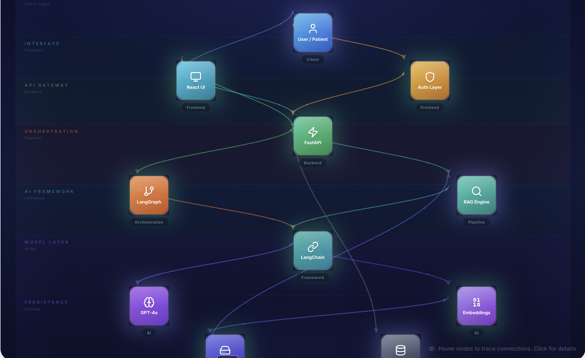

# MedAI — AI Healthcare SaaS Platform

A production-grade AI healthcare dashboard powered by **React 18 + TypeScript** (frontend) and **FastAPI + LangChain + LangGraph + OpenAI** (backend). Features an AI Doctor chat, medical report analysis with RAG, hospital & medicine search, vitals tracking, an interactive Learning Lab, and a full admin panel.

> **Clone. Run one command. Done.** Works locally, in Docker, or publicly via ngrok.

---

## 3D Architecture Diagram

<p align="center">
  
</p>

*Interactive 3D architecture visualization built into the Learning Lab — hover nodes to trace connections, click for details.*

---

## Admin Panel

<p align="center">
  
</p>

*Full admin dashboard with user management, session analytics, search logs, and system monitoring.*

---

## Key Features

| Feature | Description |
|---------|-------------|
| **AI Doctor Chat** | GPT-4o powered medical consultation with structured analysis (conditions, specialists, risk level, tests) |
| **Report Analysis** | Upload PDF lab reports — FAISS RAG indexing — AI-powered biomarker analysis |
| **Hospital Finder** | Location-aware hospital search with ratings, Practo and Google Maps booking links |
| **Medicine Search** | AI-recommended medicines with dosage info and 1mg / PharmEasy buy links |
| **Vitals Tracking** | Manual entry of heart rate, BP, SpO2, temperature, blood sugar, weight — with trend charts |
| **Learning Lab** | Interactive 3D architecture diagrams, guided AI/ML lessons with quizzes |
| **Auto Location** | Browser geolocation + OpenStreetMap reverse geocoding |
| **Auth System** | JWT-based signup / login / logout with role-based access (user and admin) |
| **Admin Dashboard** | User management, session logs, search analytics, chat history |
| **API Key via UI** | No API key in code — admin pastes their OpenAI key in the Settings page |

---

## Tech Stack

### Frontend
- React 18 + TypeScript
- Vite (build tool)
- Tailwind CSS (styling)
- Framer Motion (animations)
- Lucide React (icons)
- Recharts (data visualization)
- React Router DOM (routing)
- React Three Fiber + Drei (3D diagrams)

### Backend
- FastAPI (async Python API)
- LangChain + LangGraph (multi-step AI reasoning workflows)
- OpenAI GPT-4o (medical consultation engine)
- FAISS (vector store for PDF report RAG)
- SQLite (lightweight database, auto-created)
- JWT Auth (secure token-based authentication)

---

## Quick Start

### Prerequisites

- **Docker Desktop** (recommended) — [Install Docker](https://docker.com/get-started)
- An **OpenAI API key** — you will add it in the app after login, not in code
- *(Optional)* **ngrok account** for public internet access — [Get free token](https://dashboard.ngrok.com/get-started/your-authtoken)

---

### Option 1: Docker (Recommended) — One Command

This is the fastest way. Builds everything in containers. No Node.js or Python required on your machine.

**macOS / Linux:**

```bash
git clone https://github.com/rachakondasai/MedAI.git
cd MedAI
chmod +x start-docker.sh
./start-docker.sh
```

**Windows:**

```cmd
git clone https://github.com/rachakondasai/MedAI.git
cd MedAI
start-docker.bat
```

**What happens:**
1. Docker builds the React frontend and FastAPI backend into containers
2. Nginx serves the frontend and proxies `/api/*` to the backend
3. SQLite database is persisted in a Docker volume (survives restarts)
4. If `NGROK_AUTHTOKEN` is set, ngrok auto-tunnels the app to a public URL

**After startup:**

| Resource | URL |
|----------|-----|
| App | [http://localhost](http://localhost) |
| API | [http://localhost:8000](http://localhost:8000) |
| API Docs (Swagger) | [http://localhost:8000/docs](http://localhost:8000/docs) |
| ngrok Inspector | [http://localhost:4040](http://localhost:4040) |

---

### Option 2: Docker with ngrok (Public Access)

To make the app accessible from **any device on the internet** — share the link with anyone:

```bash
# 1. Get your free ngrok auth token from https://dashboard.ngrok.com
# 2. Set it before starting:

export NGROK_AUTHTOKEN=your_token_here
./start-docker.sh

# 3. After startup, find your public URL:
curl -s http://localhost:4040/api/tunnels | python3 -c \
  "import sys,json; [print(t['public_url']) for t in json.load(sys.stdin)['tunnels']]"
```

Or add it permanently to the `.env` file in the project root:

```bash
# .env (root of project)
NGROK_AUTHTOKEN=2abc123def_your_token_here
```

Then run `./start-docker.sh` — ngrok starts automatically every time.

#### Get a Permanent ngrok URL (Free Static Domain)

By default, ngrok gives a random URL that changes each restart. To get a **permanent URL**:

1. Go to [https://dashboard.ngrok.com/domains](https://dashboard.ngrok.com/domains)
2. Click **"New Domain"** (free accounts get 1 static domain)
3. Copy the domain (e.g. `your-name-medai.ngrok-free.app`)
4. Add it to your `.env` file:

```bash
# .env
NGROK_AUTHTOKEN=your_token_here
NGROK_DOMAIN=your-name-medai.ngrok-free.app
```

5. Restart: `docker compose down && ./start-docker.sh`

Now your app is always at `https://your-name-medai.ngrok-free.app` — same URL every time!

> **Note:** ngrok requires your Mac/PC to be running. For true 24/7 access (even when your machine is off), use **Option 3: Cloud Deployment**.

> **Tip:** Anyone with the ngrok URL can use the full app (login, chat, upload reports) from their phone or laptop.

---

### Option 3: Cloud Deployment — Always-On (Render.com)

Deploy to Render.com for a **permanent URL that works 24/7**, even when your Mac is off.

**One-click deploy:**

[](https://render.com/deploy?repo=https://github.com/rachakondasai/MedAI)

**Or manually:**

```bash
chmod +x deploy-render.sh
./deploy-render.sh
```

**Manual Render setup:**

1. Go to [dashboard.render.com/new/web-service](https://dashboard.render.com/new/web-service)
2. Connect your GitHub repo
3. Choose **Docker** runtime, set Dockerfile path to `Dockerfile.render`
4. Add environment variables:
   - `JWT_SECRET` = `medai-production-jwt-secret-key-2024`
   - `OPENAI_API_KEY` = *(your key, or leave blank — add via Settings page)*
   - `PORT` = `10000`
5. Select **Free** plan → click **Create Web Service**

Your app will be live at: `https://medai-healthcare.onrender.com`

| Cloud Provider | Free Tier | Deploy Method |
|----------------|-----------|---------------|
| **Render.com** | Free (spins down after 15min idle) | `render.yaml` blueprint |
| **Railway.app** | $5 free credit/mo | Docker deploy |
| **Fly.io** | 3 free VMs | `fly launch` |
| **Oracle Cloud** | Always-free VM | Docker on VM |

---

### Option 3: Local Development (No Docker)

For developers who want hot-reload and direct file editing.

**Prerequisites:** Node.js 18+, Python 3.11+

**macOS / Linux:**

```bash
git clone https://github.com/rachakondasai/MedAI.git
cd MedAI
chmod +x start.sh
./start.sh
```

**Windows:**

```cmd
git clone https://github.com/rachakondasai/MedAI.git
cd MedAI
start.bat
```

**Manual setup (any OS):**

```bash
# 1. Install frontend dependencies
npm install

# 2. Set up Python backend
cd server
python3 -m venv venv
source venv/bin/activate        # Windows: venv\Scripts\activate
pip install -r requirements.txt
cp .env.example .env
cd ..

# 3. Start both servers
npm start
```

| Resource | URL |
|----------|-----|
| Frontend | [http://localhost:5173](http://localhost:5173) |
| Backend | [http://localhost:8000](http://localhost:8000) |
| API Docs | [http://localhost:8000/docs](http://localhost:8000/docs) |

---

### First Login

1. Open the app URL (localhost or ngrok public URL)
2. Log in with: **admin@medai.com** / **admin123**
3. Go to **Settings** and paste your **OpenAI API key**
4. Start chatting with the AI Doctor

---

## Architecture — How AI Components Connect

```
User types "I have a headache and fever"
  |
  v
[React UI] --> [Auth Layer] --> POST /api/chat
  |
  v
[FastAPI Backend]
  |-- Gets OpenAI API key
  |-- Logs message to SQLite
  |
  v
[RAG Engine] (if reports uploaded)
  |-- FAISS similarity search
  |-- Returns relevant chunks from PDFs
  |
  v
[LangGraph Agent] (3-node workflow)
  |
  |-- Node 1: generate_reply      (temp=0.3, natural response)
  |-- Node 2: generate_analysis   (temp=0.1, JSON: conditions, risk, tests)
  |-- Node 3: generate_enrichment (temp=0.2, hospitals + medicines)
  |
  v
[LangChain] --> [GPT-4o] --> [Embeddings] --> [FAISS] --> [SQLite]
  |
  v
{ reply, analysis, sources } --> React UI
```

### RAG Pipeline (Report Upload)

```
PDF Upload --> PyPDF text extraction --> RecursiveCharacterTextSplitter
  --> Chunks (1000 chars, 200 overlap)
  --> OpenAI Embeddings (text-embedding-3-small)
  --> FAISS vector store (in-memory)
  --> similarity_search(question, k=4) at query time
```

---

## Docker Commands Reference

```bash
# Build and start everything (foreground)
docker compose up --build

# Build and start in background
docker compose up --build -d

# Stop all containers
docker compose down

# View live logs
docker compose logs -f

# View only backend logs
docker compose logs -f backend

# View ngrok logs (find public URL)
docker compose logs -f ngrok

# Rebuild just the backend
docker compose up --build backend

# Shell into the backend container
docker exec -it medai-backend bash

# Check ngrok public URL
curl -s http://localhost:4040/api/tunnels | python3 -c \
  "import sys,json; [print(t['public_url']) for t in json.load(sys.stdin)['tunnels']]"

# Reset database (removes all data)
docker compose down -v
```

---

## Environment Variables

### Root `.env` (frontend + Docker)

| Variable | Description | Default |
|----------|-------------|---------|
| `VITE_API_URL` | Backend URL for frontend | `http://localhost:8000` |
| `NGROK_AUTHTOKEN` | ngrok token for public tunnel | *(empty)* |
| `NGROK_DOMAIN` | ngrok static domain (permanent URL) | *(empty)* |

### `server/.env` (backend)

| Variable | Description | Default |
|----------|-------------|---------|
| `OPENAI_API_KEY` | OpenAI API key (can also set via UI) | *(empty)* |
| `JWT_SECRET` | Secret key for JWT signing. **Must be stable across restarts.** | auto-generated |

---

## Project Structure

```
MedAI/
├── start.sh / start.bat           # One-command local start
├── start-docker.sh / .bat         # One-command Docker start
├── deploy-render.sh               # Deploy to Render.com (always-on)
├── docker-compose.yml             # Frontend + Backend + ngrok
├── Dockerfile.frontend            # Multi-stage: Node build + Nginx
├── Dockerfile.backend             # Python 3.13 + FastAPI + LangChain
├── Dockerfile.render              # Single container for cloud deploy
├── render.yaml                    # Render.com one-click deploy blueprint
├── nginx.conf                     # SPA routing + API reverse proxy (Docker)
├── nginx.cloud.conf               # Nginx config for cloud single-container
├── supervisord.conf               # Process manager for cloud container
│
├── src/                           # React frontend
│   ├── components/                # Sidebar, ChatInput, Header, Cards...
│   ├── pages/                     # Dashboard, AIDoctor, Reports, Admin...
│   └── lib/                       # api.ts, auth.ts, utils.ts
│
├── server/                        # FastAPI backend
│   ├── main.py                    # API routes
│   ├── medical_agent.py           # LangGraph 3-node AI agent
│   ├── rag_engine.py              # FAISS RAG for PDF reports
│   ├── database.py                # SQLite
│   └── auth.py                    # JWT auth
│
└── docs/                          # Documentation assets
    └── architecture-3d.png        # 3D architecture screenshot
```

---

## API Endpoints

### Auth
| Method | Endpoint | Description |
|--------|----------|-------------|
| POST | `/api/auth/signup` | Create account |
| POST | `/api/auth/login` | Log in (returns JWT) |
| POST | `/api/auth/logout` | Log out |
| GET | `/api/auth/me` | Current user info |

### Core
| Method | Endpoint | Description |
|--------|----------|-------------|
| POST | `/api/chat` | AI Doctor chat (LangGraph + RAG) |
| POST | `/api/upload-report` | Upload PDF — FAISS index + analysis |
| POST | `/api/analyze-symptoms` | Structured symptom analysis |
| GET | `/api/health` | Health check |

### User (authenticated)
| Method | Endpoint | Description |
|--------|----------|-------------|
| GET | `/api/user/chat-history` | Chat history |
| GET | `/api/user/reports` | Uploaded reports |
| DELETE | `/api/user/reports/:id` | Delete a report (also removes from RAG) |
| POST | `/api/user/vitals` | Add vitals entry |

### Admin (admin role)
| Method | Endpoint | Description |
|--------|----------|-------------|
| GET | `/api/admin/overview` | Dashboard stats |
| GET | `/api/admin/users` | All users |
| POST | `/api/admin/create-user` | Create user |
| DELETE | `/api/admin/users/:id` | Delete user |
| PATCH | `/api/admin/users/:id/role` | Toggle role |
| GET | `/api/admin/sessions` | All sessions |
| GET | `/api/admin/search-stats` | Aggregated stats |

Full interactive docs at **http://localhost:8000/docs** (Swagger UI).

---

## Pages Overview

| Page | Route | Description |
|------|-------|-------------|
| Dashboard | `/` | Health score, vitals chart, recent activity |
| AI Doctor | `/ai-doctor` | GPT-4o chat with structured medical analysis |
| Reports | `/reports` | Upload PDFs, view AI analysis |
| Hospitals | `/hospitals` | Location-aware hospital finder |
| Medicines | `/medicines` | AI-powered medicine search |
| History | `/history` | Timeline of all consultations |
| Learning Lab | `/learning` | Interactive AI/ML lessons with 3D diagrams |
| Settings | `/settings` | API key, profile, preferences |
| Admin | `/admin` | User management, analytics, logs |

---

## Troubleshooting

| Issue | Solution |
|-------|----------|
| "Invalid or expired token" | Log out and log back in |
| Backend not starting | `docker compose logs backend` |
| ngrok URL not showing | Verify `NGROK_AUTHTOKEN` is set |
| "OpenAI API key not configured" | Go to Settings and paste your key |
| Docker build fails | `docker compose down && docker compose up --build` |
| Port 80 in use | Change port in `docker-compose.yml` |
| Database reset | `docker compose down -v` |

---

## License

MIT — free for personal and commercial use.

---

Built with care by the MedAI team.
